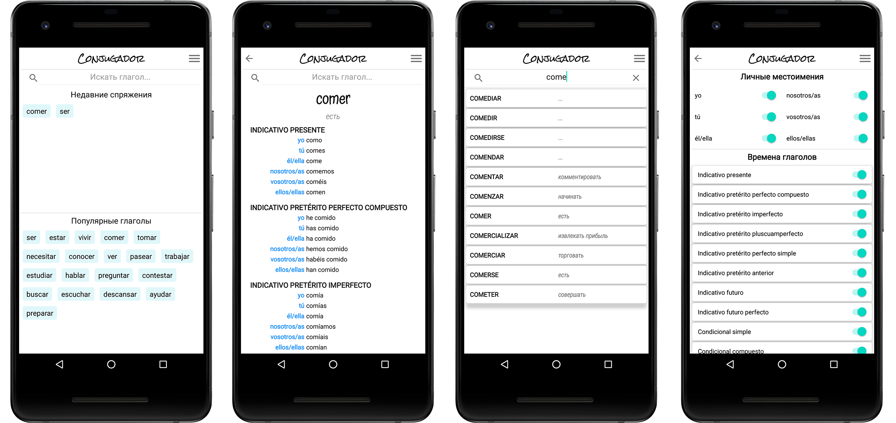

# Conjugador. Italian verbs.

Спряжения и формы большинства итальянских глаголов.

Более 8000 глаголов во всех временах.
С простой навигацией и поиском.

Основные особенности:
- Найденные глаголы автоматически добавляются в список "Недавние спряжения";
- Настроика отображаемых времена и форм глаголов;
- Небольшой размер.
- Работает без Интернета.
- Основные значения глаголов на русском, английском (перевод).

Целевая аудитория: для изучающих испанский всех уровней.

### Технологии : MVVM, Android SDK , Kotlin, Coroutines, RXJava2, Dagger2, Room, Xml, Android Jetpack Libraries.

